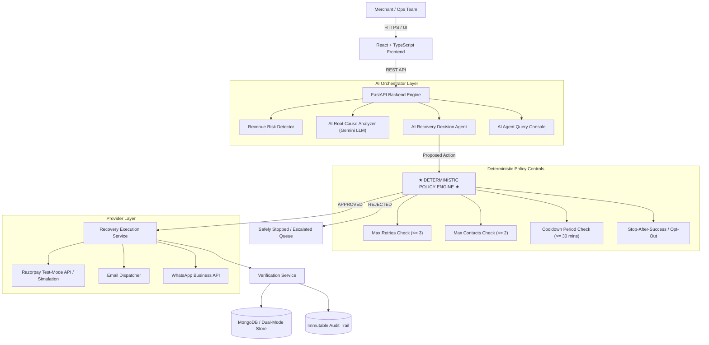

# RecoverAI System Architecture

RecoverAI is an autonomous, policy-guarded revenue recovery platform designed for merchant transaction monitoring and bounded recovery execution.

## System Flow & Component Architecture

## Key Architectural Principles

1. **Deterministic Safety Primacy:** AI agents generate recommendations, but NO financial action is executed without passing through the deterministic Policy Engine.
2. **Fail-Safe Reliability:** Automatic dual-mode database (MongoDB Atlas + built-in JSON fallback) and Razorpay integration (Live Test Mode + Simulation fallback) guarantee zero downtime.
3. **Structured AI Validation:** All Gemini LLM outputs are strictly schema-validated via Pydantic; invalid responses trigger immediate deterministic rule fallback.
4. **Immutable Audit Events:** Every detection, diagnosis, policy check, and provider API response is logged in an immutable audit timeline.
